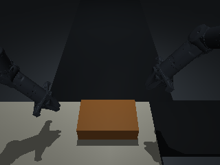

# Logistics Sorting Sim

双 PiPER 机械臂的 MuJoCo 包裹翻面与出料输送仿真任务。独立于 RL-100、π0.5 或任何训练框架，可用于 BC、VLA 和 RL 策略对照。

**任务**：将标签朝下的包裹翻至朝上，释放到出料带，并稳定输送出指定区域。默认 SKU09，另附 SKU02 场景。单包裹、固定工位；不包含连续进料调度。



## 安装与运行

Python 3.10+，建议 Linux。MuJoCo 固定为 **3.13.0**，场景使用移动接触表面 `surfacevel`，不要随意降级。

```bash
git clone https://github.com/csgaole/logistics-sorting-sim.git
cd logistics-sorting-sim
python3 -m venv .venv
source .venv/bin/activate
pip install -e '.[test]'
pytest -q
logistics-sorting-demo --sku SKU09 --seed 0
```

默认演示只保持初始关节位置，用于检查环境，会超时；不是专家策略，也不代表分拣已成功。

三相机离屏渲染：

```bash
MUJOCO_GL=egl logistics-sorting-demo --render --output demo_output
```

需可用 EGL 驱动；无 GPU 的 Linux 可安装系统 OSMesa 库后使用 `MUJOCO_GL=osmesa`。`MUJOCO_GL` 必须在导入 MuJoCo 前设置。无渲染的物理测试不需要 GPU。示例输出全局及左右腕 PNG。

## 策略接入

```python
import numpy as np
from logistics_sorting_sim import LogisticsSortingEnv

with LogisticsSortingEnv(sku="SKU09", render=False) as env:
    observation, info = env.reset(seed=123)
    # 替换为策略输出：8 个连续物理 tick 的绝对关节目标。
    actions = np.tile(observation["proprio"][:14], (8, 1))
    observation, reward, terminated, truncated, info = env.step(actions)
```

- `step` 接受 `(14,)` 或 `(N,14)`，`1 <= N <= 8`；每行执行 **1/240 秒**。8 行对应 30Hz 重规划。
- 14 维依次为左臂 6 关节、夹爪宽度、右臂 6 关节、夹爪宽度。关节目标为绝对弧度。
- **夹爪列 6/13 当前不驱动开合**：保持原实验固定宽度 0.012m。关节目标有角度限位及 3rad/s 命令速度限制；加速度仅记录。
- `observation` 只含三路 RGB、28 维 proprio 和时间戳；proprio 为两臂的位置/夹爪宽度共14维，再接对应速度14维。
- `render=True` 时 RGB 默认为240×320×3 uint8。`policy_observation()` 是可选原BC适配器，提供两帧96×96图像；新模型可直接读取原始 RGB。
- 真实物体姿态/接触力仅在 `info["evaluation"]` 中供评估，不能当视觉策略输入。
- `reward=1` 仅成功时产生，其他时刻为0。掉落为 terminated，10秒超时为 truncated。`executed_ticks` 明确终止块实际执行长度。
- 此接口采用类似 Gym 的返回约定，但不是 `gymnasium.Env`，未注册 Gym ID。

详见 [任务契约](docs/TASK.md) 与 [验证记录](docs/VALIDATION.md)。

## 原实验一致性

保留原场景暗背景、中心全局相机、双腕相机、阴影、关闭MSAA，以及关节位置驱动增益1600。默认seed仅扰动物体初始xy，各±5mm。原实验中直接补光使冻结策略退化，因此发布版本不擅自修改光照。

SKU名称不是XML数字：SKU02对应历史索引1，SKU09对应索引4。其他目录中的历史SKU目录索引不作为公开支持接口。

## 范围与文件

- 包含：两套场景、网格、初始姿态、相机、控制器、成功判定、演示和测试。
- 不包含：训练数据、模型权重、RL-100/π0.5训练实现、任何真实机械臂/CAN/ROS/PLC连接。
- 这是单任务仿真基准，不声称100%成功、不声称物理参数已对真实硬件标定。
- 不应将本仓库理解为 RL-100 官方实现。

机器人资源来源及保留许可证见 [THIRD_PARTY_NOTICES.md](THIRD_PARTY_NOTICES.md)。公开发布不自动为原创项目文件授予开源许可，见 [LICENSE.md](LICENSE.md)。
